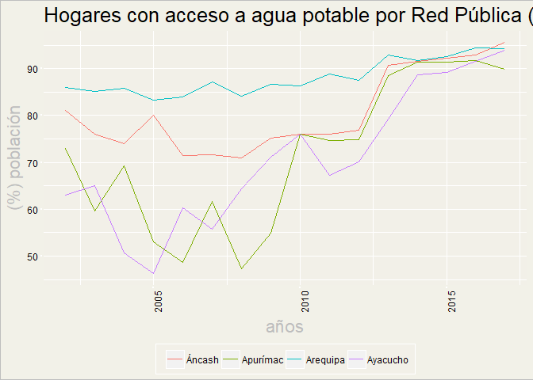
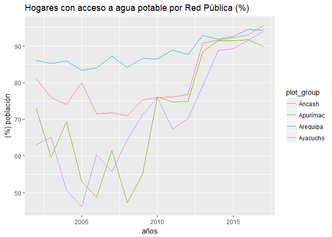

<!-- README.md is generated from README.Rmd. Please edit that file -->
INEI
====

El objetivo del paquete es utilizar de forma sencilla la data del INEI.

Instalación
-----------

Si deseas instalar el paquete necesitas primero instalar R y R Studio. Posteriormente utiliza lo siguiente

``` r
if (!require("devtools")) install.packages("devtools")
if (!require("dplyr")) install.packages("dplyr")
if (!require("xts")) install.packages("xts")
if (!require("DT")) install.packages("DT")
if (!require("ggplot2")) install.packages("ggplot2")
if (!require("ggfortify")) devtools::install_github("sinhrks/ggfortify")
if (!require("INEI")) devtools::install_github("arturochian/INEI")
```

Example
-------

This is a basic example which shows you how to solve a common problem:

``` r
library(dplyr)
library(xts)
library(DT)
library(dygraphs)
library(INEI)
library(ggfortify)
data("aguapublica")
autoplot(aguapublica[,2:5],facets = F,main = "Hogares con acceso a agua potable por Red Pública (%)",group = "Region")
```



``` r
p<-autoplot(aguapublica[,2:5],facets = F)
p + ggtitle("Hogares con acceso a agua potable por Red Pública (%)") + xlab("años") + ylab("(%) población") 
```


